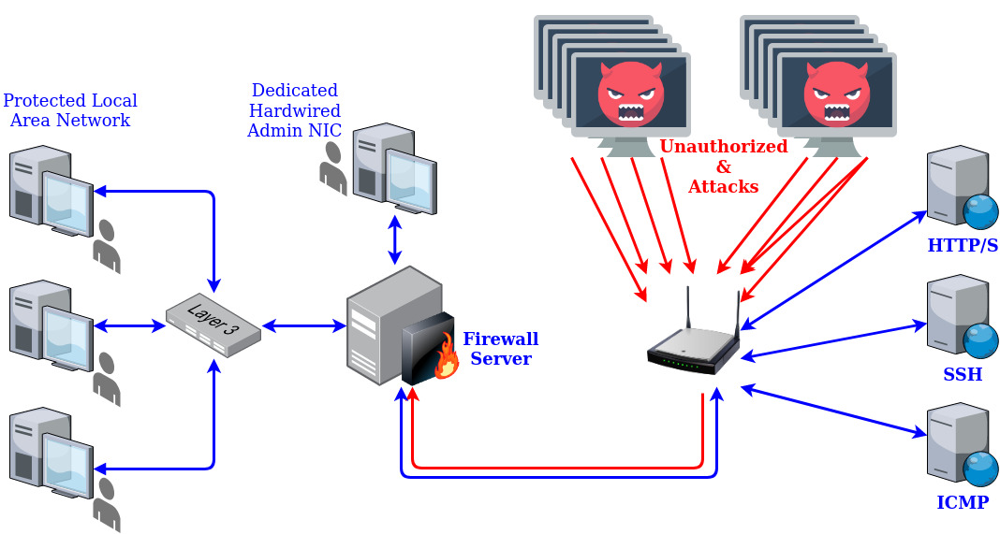

# COMP8006 - ASSIGNMENT #2 <!-- omit in toc -->
<!--[](https://www.davidsondergaard.com/)-->
[](https://www.gnu.org/software/bash/)
[](https://www.gnu.org/software/bash/)
[](https://GitHub.com/Naereen/StrapDown.js/releases/)
[](https://GitHub.com/Naereen/StrapDown.js/tags/)
[](https://lbesson.mit-license.org/)  
[](https://shields.io/)
[](https://shields.io/)
[](https://shields.io/)

Stateful firewall that protects internal network from external network threats, including common attacks and access to restricted services.



# TABLE OF CONTENTS <!-- omit in toc -->
- [SETUP / USAGE / HOW TO](#setup--usage--how-to)
  - [Clone or Download [X]](#clone-or-download-x)
  - [Configuration [X]](#configuration-x)
  - [Installation [X]](#installation-x)
    - [Install Dependencies](#install-dependencies)
    - [Run Program [X]](#run-program-x)
    - [Setup Start at Boot](#setup-start-at-boot)
  - [How To Run](#how-to-run)
  - [How To Access Logs](#how-to-access-logs)
- [FEATURES](#features)
- [USAGE](#usage)
- [DOCUMENTATION](#documentation)
  - [Project Requirements - Initial](#project-requirements---initial)
  - [Design](#design)
- [TESTS](#tests)
  - [Tests Performed](#tests-performed)
  - [Accessing Logs](#accessing-logs)
- [CONFIGURATION](#configuration)
  - [Express Configuration](#express-configuration)
  - [Detailed Configuration](#detailed-configuration)
- [FAQ](#faq)
- [POTENTIAL FUTURE IMPROVEMENTS](#potential-future-improvements)
- [TROUBLESHOOTING](#troubleshooting)
- [CONTRIBUTORS](#contributors)

# SETUP / USAGE / HOW TO

## Clone or Download [X] 
From the command line:

``` bash
git clone https://www.github.com/DavidSondergaard/COMP8006-Assignment2
```

## Configuration [X] 
See [CONFIGURATION](#configuration-1) section for either [Express Configuration](#express-configuration) or [Detailed Configuration](#detailed-configuration).

## Installation [X] 
### Install Dependencies
- Ensure that script dependencies are installed:
  - IpTables
  - NetFilter
- Ensure that ip addresses provided are not altered.  If they are, the routes will be altered.

### Run Program [X] 
Linux:  From the command line in the folder that the script is contained in, run:
``` bash
sudo ./script.sh
```

Note:  IP Addresses that were specified

### Setup Start at Boot
>Not applicable

## How To Run
*COMMAND LINE GIF*  

<!-- TERMINAL GIF CREATION:   https://github.com/chjj/ttystudio-->

<!-- SCREENCAST GIF CREATION:   https://github.com/chjj/ttystudio-->

## How To Access Logs

# FEATURES
- Stateful connection tracking
- Placement at front of network
- Deny everything approach, allowing only permitted traffic through
- Protection against:
  - XMas attack
  - ALL/ALL attack
  - Invalid packets attack
  - !SYN/New State attack
  - SYN/RST attack
  - SYN/FIN attack
  - Default port scanning from NMap (start at 0)

# USAGE

# DOCUMENTATION
Point to detailed report contained within project  

## Project Requirements - Initial
See <a href="requirements/assignment-2_Ass2-PTS-20.pdf"> Assignment 2 Requirements</a>

## Design
<!---->
<!-- note flags are /color/width/height/tag1,tag2,tagn/[optional all]   note color is g=grey, r, g, b-->


# TESTS
## Tests Performed

## Accessing Logs

# CONFIGURATION
## Express Configuration

## Detailed Configuration

# FAQ

# POTENTIAL FUTURE IMPROVEMENTS
- Load filters for attacks from external file to make editing easier.

# TROUBLESHOOTING
- **Issue**:  Script causes errors when ran.
   
    **Potential Solution(s)**:  
            - Ensure Netfilter and iptables are installed  
            - Ensure that you are starting script with elevated permissions  
            - Ensure that you have rights to execute the script


# CONTRIBUTORS
<!-- 
To get md5 hash for gravatar, it needs to be generated based on lowercase email address.  
To do this in linux: 
echo -n person@example.com | md5sum 
-->
<!--
| <!-- ROW 1 -> <a href="https://www.davidsondergaard.com" target="_blank">**David Sondergaard**</a> |
| :---: |
| <!-- ROW 2 -> [](PersonalWebsiteAddress) | 
| <!-- ROW 3 -> <a href="http://github.com/DavidSondergaard" target="_blank">`github.com/DavidSondergaard`</a> |
-->


<!-- TWO PERSON TABLE (second dash removed from each row commend to enable block comment)-->

| <!-- ROW 1 --><a href="https://www.davidsondergaard.com" target="_blank">**David Sondergaard**</a> | <a href="https://www.davidsondergaard.com" target="_blank">**lexkahng**</a> |
| :---: | :---: | 
 |<!-- ROW 2 --> [](PersonalWebsiteAddress) | [](PersonalWebsiteAddress) |   
| <!-- ROW 4--> <a href="http://github.com/DavidSondergaard" target="_blank">`github.com/DavidSondergaard`</a> | <a href="http://github.com/lexkahng" target="_blank">`github.com/lexkahng`</a> |
| **Roles / Contributions** | **Roles / Contributions** |

